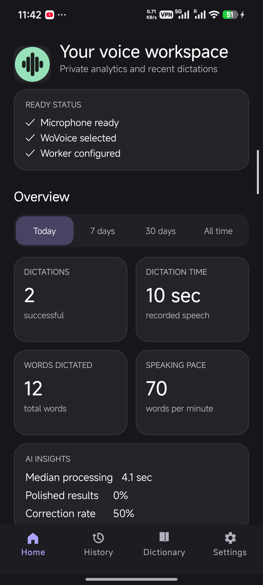
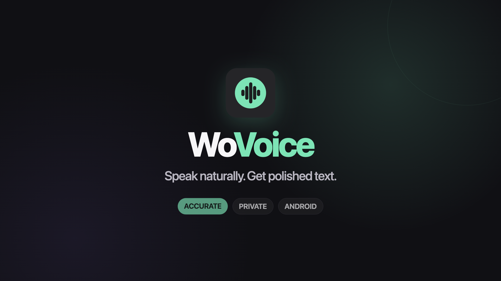
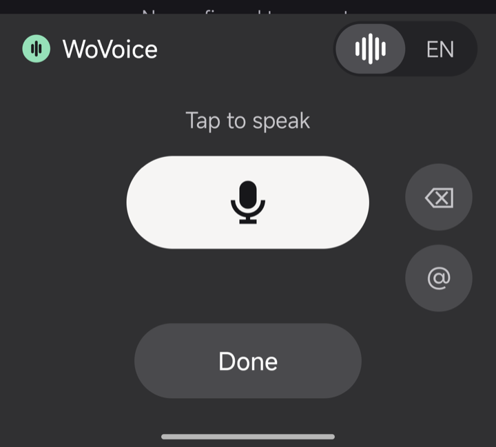
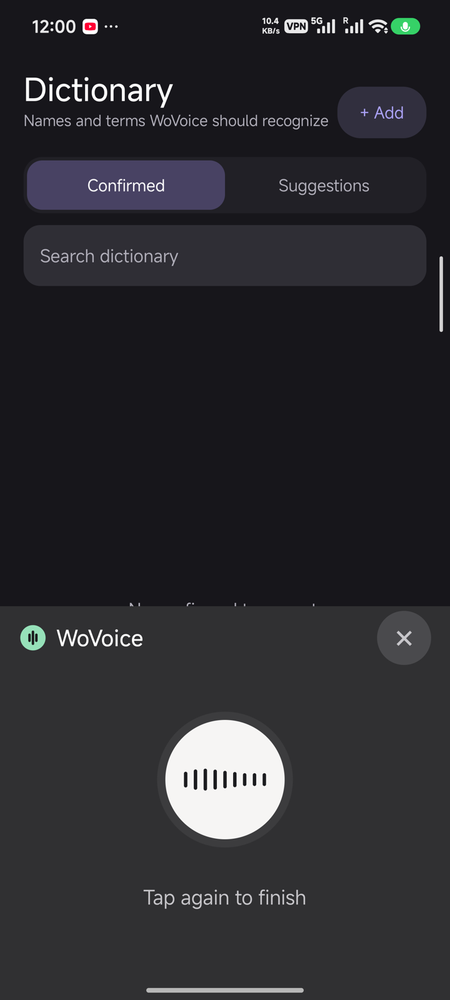
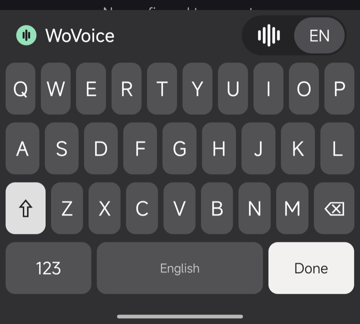
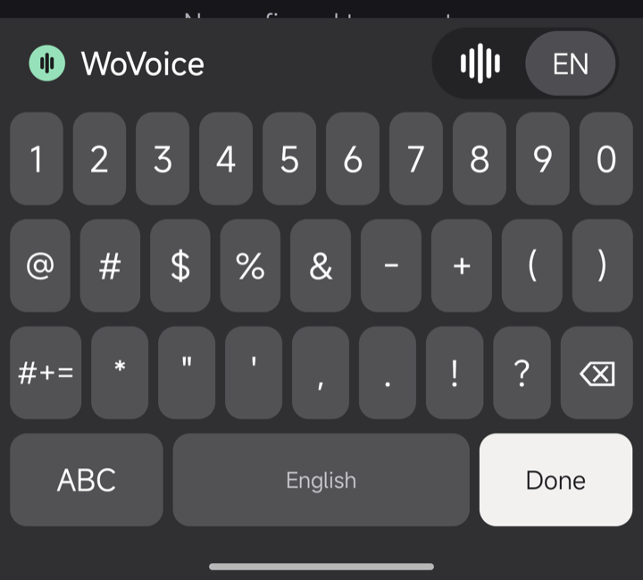
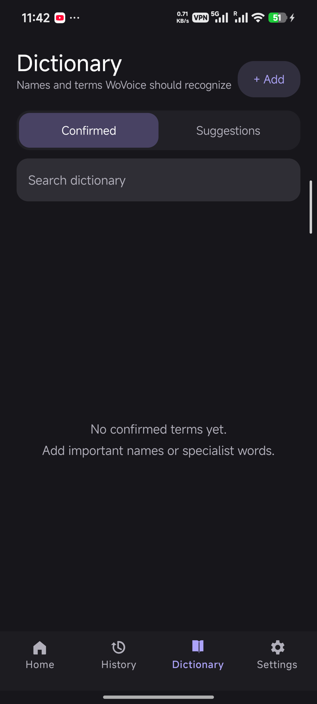

  

<h1 align="center">WoVoice</h1>

  <strong>Speak naturally. Get clear, ready-to-use text.</strong> 
  A private, speech-first Android keyboard for accurate English dictation.

  <a href="https://github.com/aliahadmd/wovoice/releases/latest"><strong>Download the latest APK</strong></a>
  ·
  <a href="https://wovoice.aliahad.com/status"><strong>Service status</strong></a>

WoVoice lets you speak into any normal Android text field instead of typing everything by hand. It listens after one tap, processes the complete thought after a second tap, adds punctuation and light corrections, then inserts the final text exactly where you started.

WoVoice is a free public beta distributed directly through GitHub rather than the Play Store. Its main recognition language is **English (India)**, with special attention to South Asian pronunciation, names, numbers, punctuation, and everyday sentences.

  

## Contents

- [What WoVoice offers](#what-wovoice-offers)
- [Product video](#product-video)
- [Download and requirements](#download-and-requirements)
- [First-time setup](#first-time-setup)
- [Using voice dictation](#using-voice-dictation)
- [Voice keyboard controls](#voice-keyboard-controls)
- [Manual keyboard](#manual-keyboard)
- [Dashboard guide](#dashboard-guide)
- [Accuracy tips](#tips-for-the-best-accuracy)
- [Privacy and local data](#privacy-and-local-data)
- [Troubleshooting](#troubleshooting)

## Product video

  

## What WoVoice offers

- Accuracy-first English speech recognition with automatic punctuation.
- Light grammar, capitalization, and spacing cleanup without rewriting your meaning.
- Smart formatting for common numbers, dates, and ordinary dictation.
- Spoken **“new line”** and **“new paragraph”** commands.
- A smooth tap-to-record, tap-to-finish workflow with a live waveform.
- Automatic insertion into the same field where dictation began.
- A complete manual QWERTY keyboard with numbers and two symbol pages.
- A personal Dictionary for names, places, brands, and specialist terms.
- Local History with search, copy, details, deletion, and Undo.
- Private usage analytics such as speaking time, words, WPM, and processing speed.
- Estimated Workers AI cost and usage, clearly separated from actual billing.
- No advertising, tracking, typing-history collection, or crash-reporting SDK.

## Download and requirements

Download the current APK from [GitHub Releases](https://github.com/aliahadmd/wovoice/releases/latest). WoVoice supports Android 7.0 and later and is optimized for the Redmi K80 Pro on Android 16.

The account, synchronization, and speech service is hosted at [wovoice.aliahad.com](https://wovoice.aliahad.com). Voice input uses a verified WoVoice account; there is no shared device token to copy into the app. The manual keyboard remains available while signed out or offline.

## First-time setup

Open WoVoice and go to **Settings → Setup**.

1. Tap **Allow** beside Microphone and approve microphone access.
2. Tap **Enable** beside Keyboard access.
3. In Android's keyboard settings, turn on **WoVoice**.
4. Return to the app and tap **Choose**.
5. Select **WoVoice** as the active keyboard.
6. Under **Account**, tap **Sign in or create account**.
7. Enter your email in the secure WoVoice page, complete the security check, and enter the six-digit code.
8. Return to WoVoice and save the recovery key when encrypted sync is offered.

The Home readiness card should show:

- **Microphone ready**
- **WoVoice selected**
- **Account ready**
- **Network available**

Android may show a standard warning when enabling any downloaded keyboard. Confirm that the keyboard name is WoVoice before accepting.

> Speech-to-text requires an internet connection and a valid WoVoice account. The manual keyboard continues to work without either one.

## Using voice dictation

### 1. Open WoVoice

Tap a text field in Notes, Messages, a browser, email, or another Android app. If a different keyboard appears, use Android's keyboard picker and choose WoVoice.

The voice-ready screen looks like this:

  

### 2. Start recording

Tap the large white microphone button once. Recording begins immediately, the layout expands, and the center waveform responds to the microphone level.

  

While this screen is visible:

- Speak normally rather than one word at a time.
- Tap the waveform or the **“Tap again to finish”** area when finished.
- Tap **×** to cancel. Cancelled speech is not inserted or added to History.
- Recording stops automatically at the 60-second limit.

### 3. Let WoVoice process the complete thought

After the second tap, WoVoice shows a processing state. The complete recording is recognized first so punctuation and sentence structure can use the full context. There are no unstable partial words placed in the editor.

Do not change to another text field while processing. If focus changes, the keyboard closes, or another editor becomes active, WoVoice deliberately discards the late result rather than inserting text into the wrong place.

### 4. Receive the final text

WoVoice inserts the final result in one operation. It checks only the adjacent cursor character on the phone to decide whether a leading or trailing space is needed. Surrounding text is not sent with the request.

Examples of natural speech:

| You say | Intended result |
| --- | --- |
| “Can we meet tomorrow morning” | Can we meet tomorrow morning? |
| “My order number is four eight two nine” | My order number is 4829. |
| “First item new line second item” | First item Second item |
| “Thank you new paragraph Please send the report” | Thank you.  Please send the report. |

Punctuation is normally inferred, so you do not need to say “comma” or “full stop” in ordinary speech.

## Voice keyboard controls

| Control | Function |
| --- | --- |
| **Waveform / EN pill** | Switches between voice mode and the manual English keyboard. |
| **Microphone** | Tap once to record and tap again to finish. |
| **× while recording** | Cancels the recording without inserting or saving a result. |
| **Delete icon** | Deletes text immediately before the cursor. |
| **@ button** | Inserts an at-sign without changing to the symbol keyboard. |
| **Done / Enter / Next / Search / Send / Go** | Performs the action requested by the current text field. |
| **Horizontal swipe** | Moves between voice and manual modes without pressing the key under the gesture. |

The action key changes automatically. For example, a search box receives **Search**, a message field may receive **Send**, a form may receive **Next**, and a multiline note receives **Enter**.

### Sensitive fields

Voice input is disabled for password and PIN fields. WoVoice forces the manual layout so secret values are never recorded for transcription.

Dictionary learning is also avoided in passwords, PINs, email addresses, URLs, fields that disable personalized learning, and other unsuitable editors.

## Manual keyboard

Tap **EN** in the voice/manual pill or swipe horizontally to open the manual keyboard.

### Letters and capitalization

<table>
  <tr>
    <td align="center"></td>
    <td align="center"></td>
    <td align="center"></td>
  </tr>
  <tr>
    <td align="center"><strong>One-shot Shift</strong></td>
    <td align="center"><strong>Lowercase</strong></td>
    <td align="center"><strong>Caps Lock</strong></td>
  </tr>
</table>

- Tap **Shift** once to change the next letter's case.
- Shift turns off after a one-shot capital is typed.
- Double-tap **Shift** to enable Caps Lock.
- Tap Shift again to leave Caps Lock.
- WoVoice can begin with capitals automatically at the start of a sentence.

### Numbers and symbols

Tap **123** to open numbers and common punctuation.

<table>
  <tr>
    <td align="center"></td>
    <td align="center"></td>
  </tr>
  <tr>
    <td align="center"><strong>Numbers and common symbols</strong></td>
    <td align="center"><strong>Additional symbols</strong></td>
  </tr>
</table>

- Tap **#+=** for brackets, mathematical signs, currencies, and additional punctuation.
- Tap **123** to return to the first symbol page.
- Tap **ABC** to return to letters.

### Manual-key functions

| Key | Behavior |
| --- | --- |
| **Backspace** | Deletes one complete character; hold it for repeated deletion. Emoji and other Unicode text are handled safely. |
| **Space / English** | Inserts a normal space and shows the current keyboard language. |
| **123** | Opens digits and the first symbol page. |
| **#+=** | Opens the second symbol page. |
| **ABC** | Returns to letters. |
| **Shift** | One tap changes the next letter; double-tap enables Caps Lock. |
| **Action key** | Adapts to Done, Enter, Next, Search, Send, or Go. |

The manual keyboard intentionally stays simple and predictable. It currently has no autocorrect or suggestion strip, so it remains a dependable offline fallback.

## Dashboard guide

WoVoice uses four bottom tabs: **Home**, **History**, **Dictionary**, and **Settings**.

### Home

Home is the private voice workspace. Choose **Today**, **7 days**, **30 days**, or **All time** to view:

- Successful dictations
- Total dictation time
- Words dictated
- Speaking pace in words per minute
- Median processing time
- Polished-result percentage
- Correction rate
- Recent dictations

Only successful, inserted dictations count. Silent, cancelled, failed, and discarded recordings do not inflate speaking time or WPM.

The **Estimated AI usage** card separates speech recognition from grammar-polish usage and can show today's and the current month's estimates. The amount is a WoVoice estimate based on the Worker's pricing version; it is **not a Cloudflare invoice or account balance**.

### History

A History item is created only after final text is successfully inserted into the intended editor.

Each item can contain:

- Final generated text
- Original phone-local date and time
- Word count and audio duration
- Recognition model and polishing status
- Processing time
- Estimated usage

History never stores the audio, raw recognition result, surrounding editor text, or the name of the app where you dictated.

You can:

- Search History locally
- Copy final text
- Open details
- Delete an item
- Swipe to delete and use **Undo**
- Clear all History after confirmation

Deleting individual History items does not automatically erase anonymous daily totals. Use **Reset analytics** when you also want those totals removed.

### Dictionary

Dictionary helps recognition of unusual names and specialist vocabulary.

  

Use **+ Add** to save a term manually. Confirmed entries can be searched, edited, and deleted. WoVoice can keep up to 1,000 entries locally and selects the most useful confirmed terms for each transcription.

When correction learning is enabled, WoVoice may detect a likely word replacement made immediately after its dictation. It creates a reviewable item under **Suggestions** rather than silently changing the Dictionary.

Approve only corrections that represent a name or distinctive term you want recognized later. Ordinary grammar edits, large rewrites, URLs, and ambiguous corrections should not become Dictionary entries.

Only approved terms may be included in later transcription requests. The surrounding correction context never leaves the phone.

### Settings

Settings is organized into these areas:

- **Setup:** microphone permission, keyboard enablement, active-keyboard picker, and readiness.
- **Account:** verified email, today’s free quota, sync state, recovery controls, signed-in devices, logout, and account deletion.
- **Voice & language:** English (India), light polish, punctuation, and spoken line commands.
- **Keyboard:** haptics, animations, waveform, and manual keyboard preferences.
- **History & analytics:** local History, cost display, clear History, and reset analytics.
- **Dictionary & learning:** correction suggestions and Dictionary management.
- **Privacy & data:** local-storage explanation and clear-all-data action.
- **About:** app version and Worker/privacy information.

## Tips for the best accuracy

- Hold or place the phone about 15–30 cm from your mouth.
- Wait for the recording animation before beginning the sentence.
- Use complete thoughts of roughly 5–15 seconds when practical.
- Speak at a natural pace and pause briefly between sentences.
- Avoid touching or covering the phone's microphone while speaking.
- Move closer to the phone in mild noise instead of shouting.
- Add important names, business terms, and uncommon spellings to Dictionary.
- Review correction Suggestions so useful terms are learned without saving mistakes.
- Use “new line” and “new paragraph” clearly and deliberately.
- Check critical names, dates, amounts, and numbers before sending important text.

## Privacy and local data

WoVoice is designed to collect as little information as possible:

- The active recording is written only to temporary app-private storage.
- Temporary audio is deleted after success, failure, cancellation, timeout, keyboard dismissal, or cleanup.
- History, analytics, and Dictionary entries are partitioned by account in the app's private phone storage.
- Optional synchronization encrypts each approved record on the phone before upload. Cloudflare stores ciphertext, not readable history or Dictionary text.
- The rotating refresh token and local vault key are encrypted with Android Keystore-backed AES-GCM.
- The recovery secret is shown only after device-credential confirmation and can be transferred by manual key or offline QR scan.
- Phone backups are disabled for WoVoice data.
- Surrounding text, clipboard contents, contacts, typing history, and source-app identity are not sent.
- Correction context stays on the phone; only approved Dictionary terms can be used as glossary hints.
- There are no advertising, analytics, or crash-reporting SDKs.

Three different cleanup actions are available because they affect different information:

| Action | What it removes |
| --- | --- |
| **Clear history** | Individual final-text records. |
| **Reset analytics** | Anonymous daily usage totals and calculated insights. |
| **Clear all data** | History, analytics, Dictionary data, and other local WoVoice information. |

Account deletion requires a fresh email code and removes sessions, synchronized ciphertext, and identifiable service usage. See [Delete your account](https://wovoice.aliahad.com/delete-account).

## Understanding messages and states

| Message or state | Meaning |
| --- | --- |
| **Tap to speak** | WoVoice is ready. |
| **Tap again to finish** | Recording is active. |
| **Thinking / Processing** | Audio is being recognized and lightly polished. |
| **No clear speech** | The recording was silent or too quiet to use. It is discarded locally. |
| **Connection failed** | The WoVoice service could not be reached. |
| **Sign in to use voice** | The account session is missing or expired; the manual keyboard still works. |
| **Daily limit reached** | The account has used its free 10 minutes for the current UTC day. |
| **Try again** | No text was inserted; return to the same field and record again. |

## Troubleshooting

### WoVoice does not appear

1. Open **WoVoice → Settings → Setup**.
2. Tap **Enable** and confirm WoVoice is turned on.
3. Tap **Choose** and select WoVoice.
4. Tap a normal text field again.

### “No clear speech” appears

- Confirm Microphone shows **Allowed and ready**.
- Wait until the waveform screen appears before speaking.
- Move closer to the phone and speak at a normal volume.
- Check that a case, finger, or surface is not blocking the microphone.
- Try a short sentence in a quieter place.

### Recording works but transcription fails

- Check Wi-Fi or mobile data.
- Open **Settings → Account** and confirm the verified email and quota appear.
- If the session expired, tap **Sign in** and complete the email code again.
- Open [WoVoice service status](https://wovoice.aliahad.com/status) to check API availability.

### A name or term is wrong

1. Open **Dictionary**.
2. Tap **+ Add**.
3. Enter the exact spelling.
4. Save it and use it in the next dictation.

### Text was not inserted

WoVoice protects against inserting a late result into the wrong app or field. Keep the original text field active until processing finishes, then try again if the editor changed.

### A dictation is missing from History

History records only successful insertion. Check that:

- The result was inserted.
- History is enabled in Settings.
- The recording was not cancelled, silent, failed, or discarded after focus changed.

### The action key says something unexpected

The destination app controls the requested editor action. WoVoice follows that request, so the same key may show Done, Enter, Next, Search, Send, or Go in different fields.

## Current limits

- Recognition is currently focused on English (India).
- Each recording is limited to 60 seconds.
- Speech-to-text requires internet access and a verified account.
- Free beta accounts currently receive 600 validated audio seconds per UTC day.
- The manual keyboard has no autocorrect or word-suggestion strip.
- Cost and neuron figures are estimates for WoVoice requests, not actual account billing.

## License

WoVoice is proprietary source-available software. Its source code may be viewed
and evaluated, but copying, modification, redistribution, deployment, and
commercial use are prohibited without prior written permission. See the
[WoVoice Proprietary Source-Available License](LICENSE.md) for the complete
terms.
