

  

<h1 align="center">WoVoice</h1>

  <strong>Speak naturally. Get clear, ready-to-use text.</strong> 
  Private voice dictation for your Android phone and your Mac.

  <a href="https://github.com/aliahadmd/wovoice/releases"><strong>Download WoVoice</strong></a>
  ·
  <a href="https://wovoice.aliahad.com/status"><strong>Service status</strong></a>
  ·
  <a href="https://wovoice.aliahad.com/privacy"><strong>Privacy</strong></a>

WoVoice turns your speech into clean, punctuated text and puts it exactly where you were typing — in a chat, an email, a note, a browser, or any other app.

- **On Android**, WoVoice is a keyboard. Tap the microphone, speak, tap again, and the text appears in the field you were using.
- **On Mac**, WoVoice runs in the background. Hold the **⌥ Option** key anywhere, speak, let go, and the text is typed at your cursor.

Both use the same free account, so your History and Dictionary follow you from phone to Mac automatically.

WoVoice is tuned for **English (India)**, with special care for South Asian pronunciation, names, numbers, and everyday sentences. It is a free public beta, distributed directly from this page rather than the Play Store or App Store.

  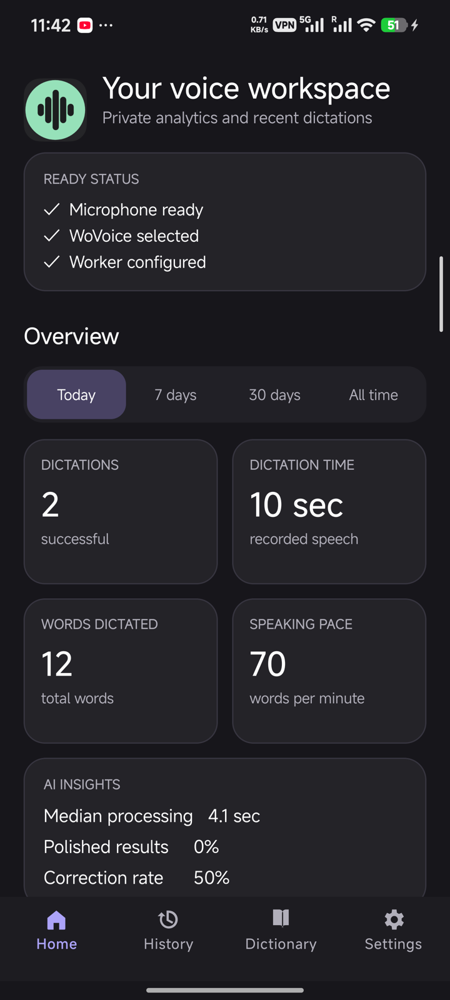
  &nbsp;&nbsp;
  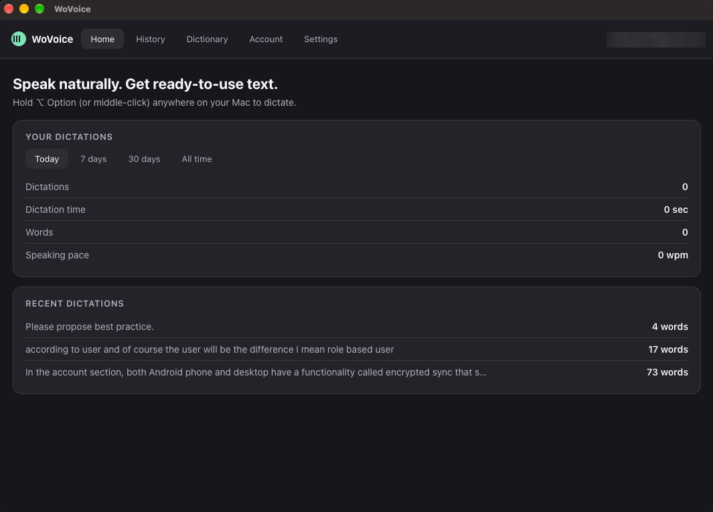

## Contents

- [What WoVoice does for you](#what-wovoice-does-for-you)
- [Product video](#product-video)
- [Your WoVoice account](#your-wovoice-account)
- [WoVoice on Android](#wovoice-on-android)
- [WoVoice on Mac](#wovoice-on-mac)
- [Sync between your devices](#sync-between-your-devices)
- [Tips for the best accuracy](#tips-for-the-best-accuracy)
- [Your privacy](#your-privacy)
- [What the messages mean](#what-the-messages-mean)
- [Troubleshooting](#troubleshooting)
- [Current limits](#current-limits)

## What WoVoice does for you

- **Writes what you meant.** Punctuation, capital letters, and spacing are added for you. You don't need to say "comma" or "full stop".
- **Cleans up lightly, never rewrites.** Filler words like "um" are removed and obvious grammar slips are fixed. Your names, numbers, and meaning stay exactly as you said them.
- **Formats numbers.** "Four eight two nine" becomes 4829.
- **Understands line breaks.** Say **"new line"** or **"new paragraph"** to start one.
- **Learns your words.** Add names, places, brands, and specialist terms to your Dictionary so they're spelled correctly every time.
- **Keeps a History** of everything you've dictated, so you can find, copy, or delete it later.
- **Shows your progress:** how much you've dictated, how many words, and how fast you speak.
- **Respects your privacy.** No ads, no tracking, and no recording of what you type. Your voice is never saved.

## Product video

  <a href="docs/portfolio/wovoice-marketing-video.mp4">
    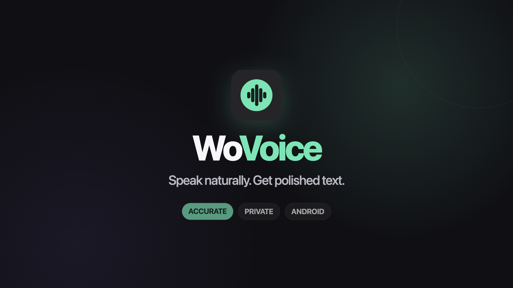
  </a>

## Your WoVoice account

Voice dictation needs a free WoVoice account. There is no password: you sign in with a six-digit code sent to your email.

1. In the app, tap or click **Sign in or create account**.
2. A secure WoVoice page opens in your browser. Enter your email address and complete the quick security check.
3. Open the email from WoVoice and enter the six-digit code.
4. You're returned to the app, signed in.

Use the same email on your phone and your Mac and they share one History and one Dictionary.

Every account includes **10 minutes of dictation per day**. The allowance resets at midnight UTC (5:30 AM in India).

---

## WoVoice on Android

Works on Android 7.0 and later.

### Install

1. On your phone, open the [Releases page](https://github.com/aliahadmd/wovoice/releases) and download the newest **WoVoice `.apk`** file.
2. Open the downloaded file. If Android asks, allow your browser to **install unknown apps**, then tap **Install**.

### Set up (about one minute)

Open WoVoice and go to **Settings → Setup**.

1. Tap **Allow** next to Microphone and approve microphone access.
2. Tap **Enable** next to Keyboard access, and turn on **WoVoice** in Android's keyboard list.
3. Return to the app and tap **Choose**, then select **WoVoice** as your keyboard.
4. Under **Account**, tap **Sign in or create account** and follow the steps above.

Android shows a standard warning when you turn on any downloaded keyboard. Check that the name says **WoVoice**, then accept.

When everything is ready, the Home screen shows **Microphone ready**, **WoVoice selected**, **Account ready**, and **Network available**.

> Voice typing needs an internet connection and a signed-in account. The regular keyboard always works, even offline.

### Dictate

**1. Open any text box.** Tap a text field in Messages, WhatsApp, Gmail, Notes, a browser, or any other app. WoVoice appears ready to listen.

  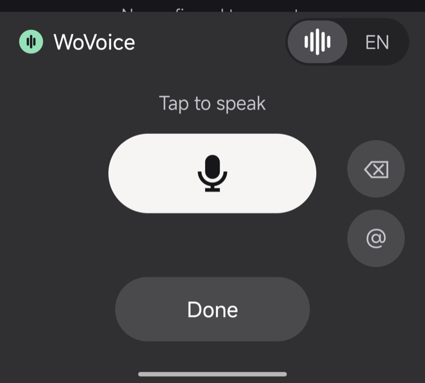

**2. Tap the big microphone and speak.** The waveform moves as you talk.

  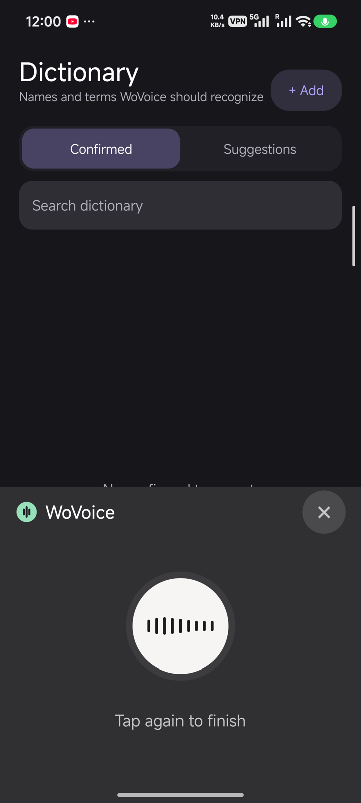

- Speak normally in full sentences, not one word at a time.
- Tap the waveform (**"Tap again to finish"**) when you're done.
- Tap **×** to cancel. Cancelled speech is thrown away.
- Recording stops on its own after 60 seconds.

**3. Wait a moment.** WoVoice listens to your whole thought first so the punctuation makes sense, then inserts the finished text in one go.

Stay in the same text box while it's working. If you switch to another box or app, WoVoice deliberately drops the result rather than typing into the wrong place.

Some examples:

| You say | You get |
| --- | --- |
| "Can we meet tomorrow morning" | Can we meet tomorrow morning? |
| "My order number is four eight two nine" | My order number is 4829. |
| "First item new line second item" | First item Second item |
| "Thank you new paragraph Please send the report" | Thank you.  Please send the report. |

### Keyboard buttons

| Button | What it does |
| --- | --- |
| **Waveform / EN switch** | Switches between voice and the regular keyboard. |
| **Microphone** | Tap to start recording, tap again to finish. |
| **×** (while recording) | Cancels without typing anything. |
| **Delete** | Deletes the character before the cursor. |
| **@** | Types an @ sign. |
| **Done / Enter / Next / Search / Send / Go** | Does whatever the app expects — sends the message, runs the search, moves to the next field, and so on. |
| **Swipe left or right** | Another way to switch between voice and the regular keyboard. |

**Passwords and PINs are protected.** In password fields WoVoice switches to the regular keyboard and turns the microphone off, so secrets are never spoken or sent anywhere.

### The regular keyboard

Tap **EN** or swipe sideways to type by hand. It works offline and has no account requirement.

<table>
  <tr>
    <td align="center">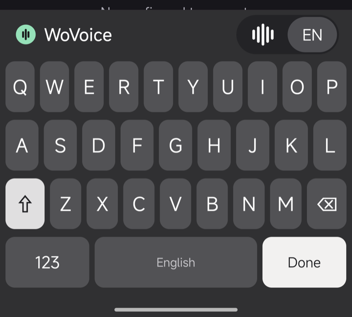</td>
    <td align="center"></td>
    <td align="center"></td>
  </tr>
  <tr>
    <td align="center"><strong>Next letter capital</strong></td>
    <td align="center"><strong>Lowercase</strong></td>
    <td align="center"><strong>Caps Lock</strong></td>
  </tr>
</table>

- Tap **Shift** once for one capital letter. Double-tap it for Caps Lock, and tap again to turn Caps Lock off.
- New sentences start with a capital automatically.
- Hold **Backspace** to keep deleting. Emoji are deleted cleanly as one character.

<table>
  <tr>
    <td align="center">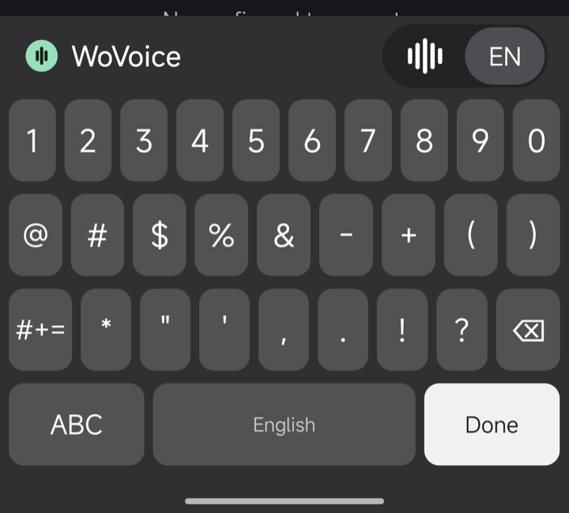</td>
    <td align="center"></td>
  </tr>
  <tr>
    <td align="center"><strong>Numbers and common symbols</strong></td>
    <td align="center"><strong>More symbols</strong></td>
  </tr>
</table>

- **123** opens numbers and punctuation. **#+=** opens brackets, maths signs, and currencies. **ABC** goes back to letters.
- **🙂** opens emoji, organised by category, with a **Recents** tab for the ones you use most.

The regular keyboard is intentionally simple. It doesn't have autocorrect or word suggestions.

### The WoVoice app

The app has four tabs at the bottom: **Home**, **History**, **Dictionary**, and **Settings**.

**Home** shows how you're doing for **Today**, **7 days**, **30 days**, or **All time**: number of dictations, time spent speaking, words, speaking pace, how quickly results came back, and your most recent dictations. Only dictations that were actually typed into an app are counted. It also shows a rough estimate of the AI processing cost of your dictations — this is for interest only; WoVoice is free and you are never charged.

**History** lists every dictation that was inserted. Search it, copy text, open the details, or delete items (swipe to delete, with **Undo**). Your voice recordings are never kept, and History doesn't record which app you were typing in.

**Dictionary** helps WoVoice spell unusual words correctly.

  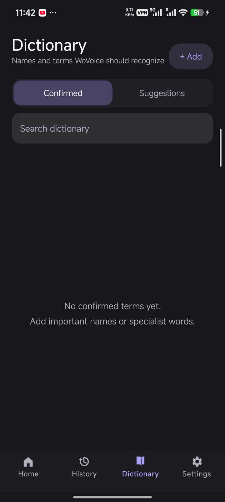

- Tap **+ Add** and type a name or term exactly as it should be spelled. You can keep up to 1,000 terms.
- If you fix a word right after dictating it, WoVoice may offer it under **Suggestions**. Approve only real names or special terms you want remembered — nothing is added without your approval.

**Settings** covers setup, your account and sync, voice options, keyboard feel (vibration, animations, waveform), History and statistics, Dictionary learning, and privacy controls.

---

## WoVoice on Mac

Hold a key, speak, release — the text appears wherever your cursor is, in any app.

### Install

1. Open the [Releases page](https://github.com/aliahadmd/wovoice/releases), find the newest **WoVoice Desktop** release, and download the `wovoice-desktop-….dmg` file.
2. Open it and drag **WoVoice** into your **Applications** folder.
3. Open WoVoice from Applications.

Because WoVoice is downloaded from the web rather than the App Store, macOS may say it can't verify the app the first time. If so, open **System Settings → Privacy & Security**, scroll down, and click **Open Anyway** next to the WoVoice message.

### Give it two permissions

WoVoice asks for exactly two permissions — nothing else. It never reads your screen, files, or browsing.

1. **Microphone** — so it can hear you while you dictate.
2. **Device Control & Data Access** (called **Accessibility** on older macOS) — so it can notice when you press your dictation key and paste the finished text at your cursor.

Both can be granted from WoVoice's **Settings** tab. The first time WoVoice pastes, macOS also asks whether WoVoice may control **System Events** — click **OK**. This is what lets it type the text for you.

  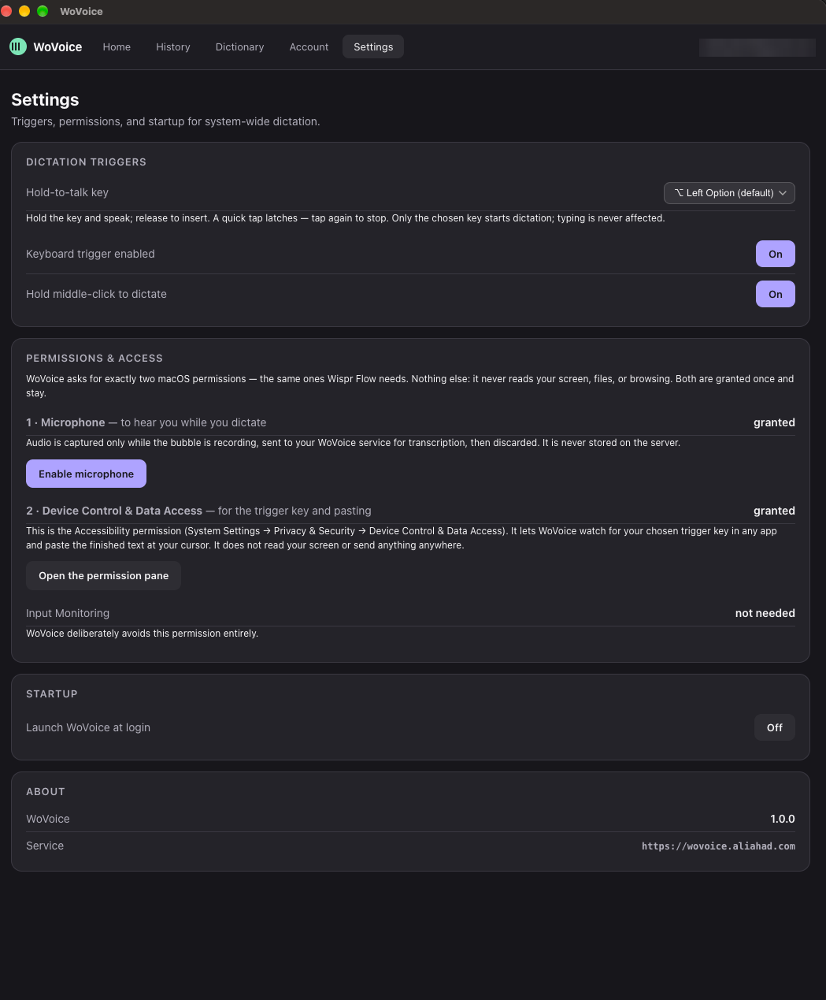

Then open the **Account** tab and sign in (see [Your WoVoice account](#your-wovoice-account)).

### Dictate

1. Click into any text box — a message, an email, a document, a search bar.
2. **Hold ⌥ Option** and start speaking. A small bubble appears at the top of your screen with a live waveform and timer.
3. **Let go** of the key. WoVoice transcribes your speech and types it at your cursor.

  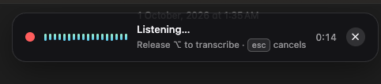

- **Hands-free:** quickly tap ⌥ Option once to keep recording without holding it. Tap it again to finish.
- **Mouse:** hold the **middle mouse button** (scroll-wheel click) to dictate, and release to finish.
- **Cancel:** press **Esc** or click **×** on the bubble.
- The bubble shows each step — listening, transcribing, done — or tells you exactly what went wrong.
- Recording stops on its own after 60 seconds, and what you said is still transcribed.

Your clipboard is put back the way it was after each paste, so dictating never overwrites something you copied.

### The WoVoice window

**Home** shows your dictations for today, the last 7 or 30 days, or all time — how many, how long, how many words, and your speaking pace — plus your most recent dictations.

**History** lists everything you've dictated, including dictations from your phone. Search it, **Copy** any item, or **Delete** it (with Undo).

  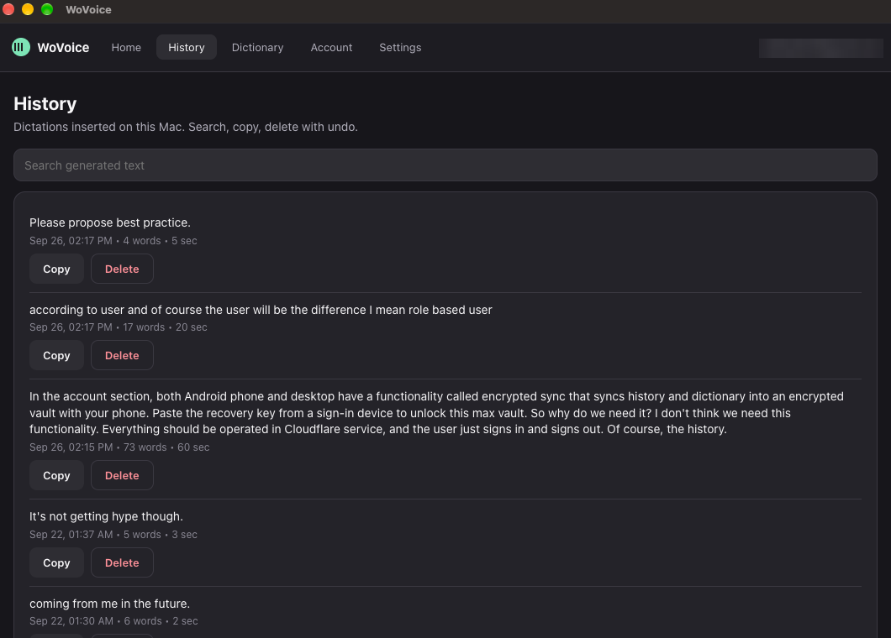

**Dictionary** lets you add and remove names and special terms. It's the same Dictionary as on your phone.

**Account** shows your email, how much of today's dictation time is left, and when it resets. This is also where you control sync (see below) and sign out.

**Settings** lets you:

- Choose your **hold-to-talk key**: left ⌥ Option (default), right ⌥ Option, left or right ⌘ Command, ⇪ Caps Lock, or the 🌐 fn / Globe key. Only the key you choose starts dictation — normal typing is never affected.
- Turn the keyboard trigger or middle-click trigger on or off.
- Check and grant permissions.
- Start WoVoice automatically when you log in to your Mac.

---

## Sync between your devices

Once you're signed in, your **History** and **Dictionary** sync between your phone and your Mac automatically. There's no recovery key or extra setup — signing in is enough. Your Android phone also syncs your Home statistics between phones.

You control this from **Account** (Mac) or **Settings → Account** (Android):

- **Sync now** — sync immediately instead of waiting.
- **Sync history** — turn this off to remove your dictated text from your account online. The copies already on your devices stay.
- **Auto-delete history** — automatically delete dictations older than 30 days, 90 days, or 1 year, on every device.
- **Signed-in devices** (Android) — see where you're signed in and sign out any device remotely.

Synced data is stored encrypted, with a key unique to your account.

## Tips for the best accuracy

- Keep the microphone about 15–30 cm (6–12 inches) from your mouth.
- Wait until recording has started before you begin speaking.
- Speak complete thoughts of about 5–15 seconds at a natural pace, with short pauses between sentences.
- Don't cover the microphone with your finger or a case.
- In a noisy place, move closer to the microphone instead of speaking louder.
- Add important names and uncommon spellings to your Dictionary.
- Say "new line" and "new paragraph" clearly and on purpose.
- Always double-check important names, dates, amounts, and numbers before sending.

## Your privacy

WoVoice is built to collect as little as possible.

- **Your voice is never stored.** Recordings are used only to produce your text and are deleted straight away — after success, failure, or cancellation.
- **Only what you dictate is processed.** The text around your cursor, your clipboard, your contacts, what you type by hand, and the name of the app you're using are never sent.
- **Passwords are safe.** Voice is turned off in password and PIN fields on Android.
- **Your Dictionary stays yours.** Only terms you've approved are used to improve recognition.
- **Your synced data is encrypted** with a key unique to your account. WoVoice's support staff never see the contents of your History or Dictionary.
- **No ads, no tracking, no crash-reporting tools.**
- Phone backups of WoVoice data are turned off, and your sign-in is protected by your device's secure storage (Android Keystore or the Mac Keychain).

You stay in control of your data:

| Action | What it removes |
| --- | --- |
| **Clear history** | Your saved dictations. |
| **Reset analytics** | Your Home statistics. |
| **Clear all data** | Everything WoVoice stores on this phone. |
| **Delete account** | Your account, every synced item, and all your sign-ins. This needs a fresh email code. |

Read the full [Privacy Policy](https://wovoice.aliahad.com/privacy) or learn how to [delete your account](https://wovoice.aliahad.com/delete-account).

## What the messages mean

| Message | Meaning |
| --- | --- |
| **Tap to speak** / **Listening…** | WoVoice is ready, or is recording. |
| **Tap again to finish** | Recording is in progress on your phone. |
| **Thinking** / **Transcribing** | Your speech is being turned into text. |
| **No clear speech** | The recording was silent or too quiet. Nothing was sent. |
| **Connection failed** | WoVoice couldn't reach its service. Check your internet. |
| **Sign in to use voice** | You're signed out or your sign-in expired. The regular keyboard still works. |
| **Daily limit reached** | You've used today's 10 free minutes. It resets at midnight UTC. |
| **Try again** | Nothing was typed. Go back to the same text box and record again. |

## Troubleshooting

### Android: WoVoice doesn't appear as my keyboard

1. Open **WoVoice → Settings → Setup**.
2. Tap **Enable** and make sure WoVoice is switched on.
3. Tap **Choose** and select WoVoice.
4. Tap a text box again.

### Mac: holding Option does nothing

- In WoVoice **Settings**, check that both permissions say **granted** and that **Keyboard trigger enabled** is **On**.
- If you recently updated WoVoice, macOS may need the permission again: open the permission pane, turn WoVoice off and on, then quit and reopen WoVoice.
- Make sure WoVoice is running — look for it in your Dock or open it from Applications.

### Mac: the text isn't pasted

- Make sure your cursor is in a text box before you start speaking.
- If macOS asked whether WoVoice may control **System Events** and you clicked Don't Allow, turn it back on in **System Settings → Privacy & Security → Automation → WoVoice → System Events**.

### "No clear speech" keeps appearing

- Check that the microphone permission is allowed.
- Wait for recording to start, then speak at a normal volume a little closer to the microphone.
- Make sure nothing is covering the microphone.
- Try a short sentence somewhere quieter.

### Recording works but no text comes back

- Check your Wi-Fi or mobile data.
- Open your account and check that your email and remaining time are shown. If your sign-in expired, sign in again.
- Check the [WoVoice service status](https://wovoice.aliahad.com/status).

### A name or word keeps coming out wrong

Add it to your **Dictionary** with the exact spelling you want, then dictate again.

### Text wasn't inserted on Android

WoVoice won't type into a different place than where you started. Keep the same text box open until it finishes, then try again.

### A dictation is missing from History

History only keeps dictations that were actually typed into an app. Cancelled, silent, failed, or abandoned recordings aren't saved. On Android, also check that History is turned on in Settings.

### The keyboard's action button says something unexpected

The app you're typing in decides whether that button is Done, Enter, Next, Search, Send, or Go. WoVoice simply follows it.

## Current limits

- Recognition is focused on English (India).
- Each recording can be up to 60 seconds.
- Voice dictation needs an internet connection and a WoVoice account.
- Free accounts get 10 minutes of dictation per day.
- The Android regular keyboard has no autocorrect or word suggestions.
- The Mac app is for macOS only; there is no Windows version yet.

## Need help?

Email [support@aliahad.com](mailto:support@aliahad.com) or check the [service status page](https://wovoice.aliahad.com/status).

## License

WoVoice is free to use. Its source code is published for viewing only; copying, modifying, redistributing, or using it commercially requires written permission. See the [WoVoice License](LICENSE.md).
